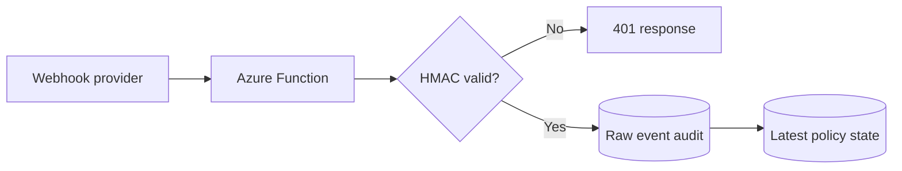

# Azure Webhook Ingestion

A secure, idempotent webhook ingestion reference built for Azure Functions. It validates HMAC signatures, preserves immutable raw events, rejects malformed payloads, deduplicates retries and maintains a latest-state model without allowing late events to overwrite newer status.

> This is an original portfolio project using synthetic policy events. It contains no employer code, credentials, customer information or proprietary API contracts.



## Reliability and security features

- Constant-time HMAC SHA-256 signature verification
- Strict JSON and required-field validation
- Immutable raw-event audit history with body hashes
- Event-ID idempotency for provider retries
- Event-time ordering for the latest-state table
- Clear `400`, `401`, `500` and success responses
- Azure Functions Python v2 programming model
- Bicep infrastructure example with HTTPS-only and TLS 1.2
- Unit tests for invalid signatures, duplicates and late-arriving events

## Run the tests

```bash
python -m venv .venv
source .venv/bin/activate
python -m pip install -e ".[dev]"
ruff check .
pytest -q
```

## Run locally with Azure Functions Core Tools

```bash
cp local.settings.example.json local.settings.json
func start
```

Create a signature for the included synthetic event:

```bash
python tools/sign_payload.py sample_data/policy_event.json --secret replace-with-a-random-secret
```

Then submit the payload:

```bash
curl -X POST http://localhost:7071/api/policy-events \
  -H "Content-Type: application/json" \
  -H "X-Webhook-Signature: sha256=YOUR_SIGNATURE" \
  --data-binary @sample_data/policy_event.json
```

## Production adaptation

The SQLite adapter keeps the project runnable locally. For production, persist raw events and latest state in Azure Database for PostgreSQL, load the HMAC secret from Key Vault through managed identity, add Application Insights alerts and place API Management in front of the function when provider IP filtering or additional throttling is required.

## Important deployment note

The sample Bicep file demonstrates the Azure resource shape. Azure Functions' writable local filesystem is temporary, so `/tmp/webhook_events.db` is only suitable for a demo. Use PostgreSQL, Azure SQL or another durable store in a real deployment.

## Author

[Dhananjay Panchal](https://dhananjay-panchal.github.io/) — Azure Data Engineer

